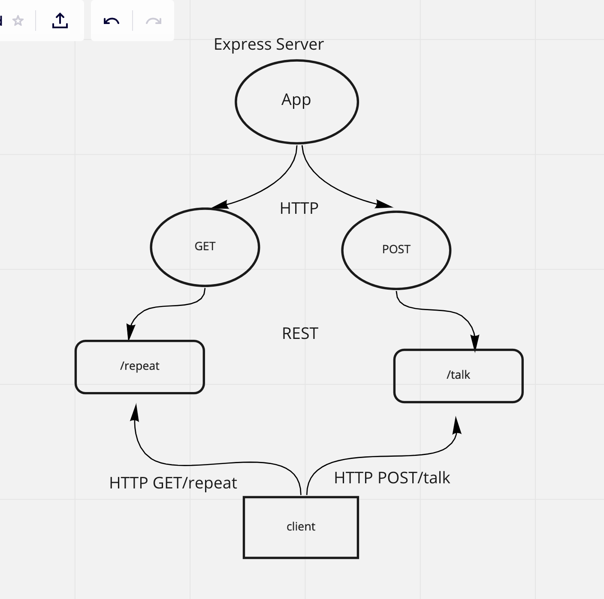

# Express Server

Created by Jacob Knaack

## Installation

## Summary of Problem Domain

## Links to application deployment

## Include embedded UML

## Talk about your routes

## Routes

* HTTP GET
  * Path: https://timma-server-deploy-prod.herokuapp.com/repeat
    * responds with the last string used in post route `/talk`.

* HTTP POST
  * Path: https://timma-server-deploy-prod.herokuapp.com/talk
    * Accepts a string.
    * responds with a string in all caps.

